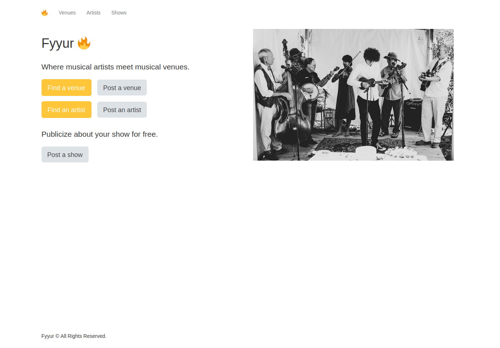

Fyyur is a musical venue and artist booking site that facilitates the discovery and bookings of shows between local performing artists and venues. This site lets you list new artists and venues, discover them, and list shows with artists as a venue owner.
It's the first project in FSND (Full Stack Nano Degree) On [Udaicty](https://www.udacity.com/course/full-stack-web-developer-nanodegree--nd0044).


Your job is to build out the data models to power the API endpoints for the Fyyur site by connecting to a PostgreSQL database for storing, querying, and creating information about artists and venues on Fyyur.


## Tech Stack (Dependencies)

### 1. Backend Dependencies
Our tech stack will include the following:
 * **virtualenv** as a tool to create isolated Python environments
 * **SQLAlchemy ORM** to be our ORM library of choice
 * **PostgreSQL** as our database of choice
 * **Python3** and **Flask** as our server language and server framework
 * **Flask-Migrate** for creating and running schema migrations
You can download and install the dependencies mentioned above using `pip` as:
```
pip install virtualenv
pip install SQLAlchemy
pip install postgres
pip install Flask
pip install Flask-Migrate
```
### 2. Frontend Dependencies
You must have the **HTML**, **CSS**, and **Javascript** with [Bootstrap 3](https://getbootstrap.com/docs/3.4/customize/) for our website's frontend. Bootstrap can only be installed by Node Package Manager (NPM). Therefore, if not already, download and install the [Node.js](https://nodejs.org/en/download/). Windows users must run the executable as an Administrator, and restart the computer after installation. After successfully installing the Node, verify the installation as shown below.
```
node -v
npm -v
```
Install [Bootstrap 3](https://getbootstrap.com/docs/3.3/getting-started/) for the website's frontend:
```
npm init -y
npm install bootstrap@3
```


## Main Files: Project Structure

  ```sh
  ├── README.md
  ├── app.py *** the main driver of the app. Includes your SQLAlchemy models.
                    "python app.py" to run after installing dependences
  ├── config.py *** Database URLs, CSRF generation, etc
  ├── error.log
  ├── forms.py *** Your forms
  ├── requirements.txt *** The dependencies we need to install with "pip3 install -r requirements.txt"
  ├── static
  │   ├── css 
  │   ├── font
  │   ├── ico
  │   ├── img
  │   └── js
  └── templates
      ├── errors
      ├── forms
      ├── layouts
      └── pages
  ```

Overall:
* Models are located in the `MODELS` section of `app.py`.
* Controllers are also located in `app.py`.
* The web frontend is located in `templates/`, which builds static assets deployed to the web server at `static/`.
* Web forms for creating data are located in `form.py`


## Demo 


***

***

***


***
<p float="left" align = "middle">
  
   
  
</p>

***


##  Try It
1. **Download the project code locally**
```
git clone https://github.com/Passant-Abdelgalil/Fyyur-Backend.git
cd Fyyur-Backend
```
2. **Initialize and activate a virtualenv using:**
```
python -m virtualenv env
source env/bin/activate
```
>**Note** - In Windows, the `env` does not have a `bin` directory. Therefore, you'd use the analogous command shown below:
```
source env/Scripts/activate
```

3. **Install the dependencies:**
```
pip install -r requirements.txt
```
4. **Database Config**
```
make sure to change the connection string in config.py to meet your database
```
5. **Run the development server:**
```
export FLASK_APP=myapp
export FLASK_ENV=development # enables debug mode
python3 app.py
```
