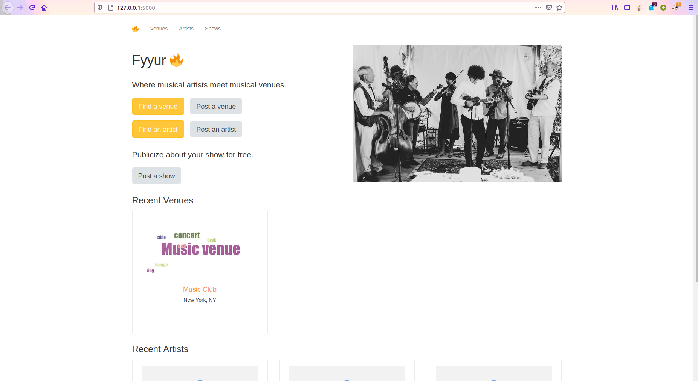
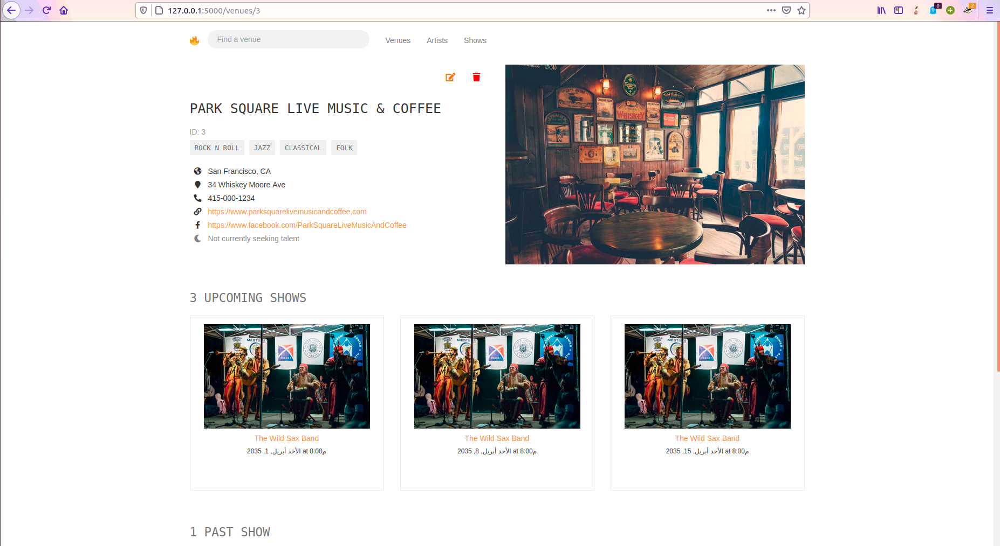
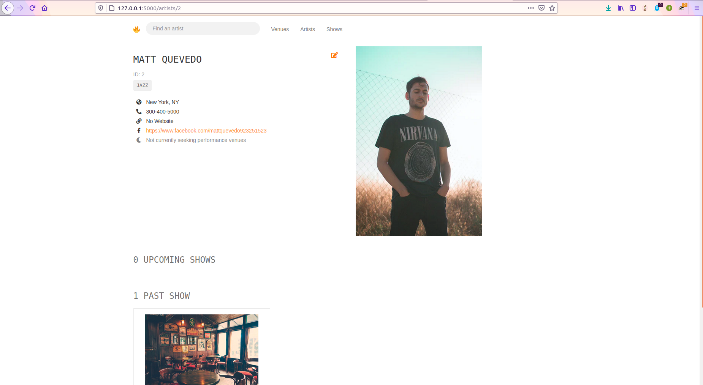
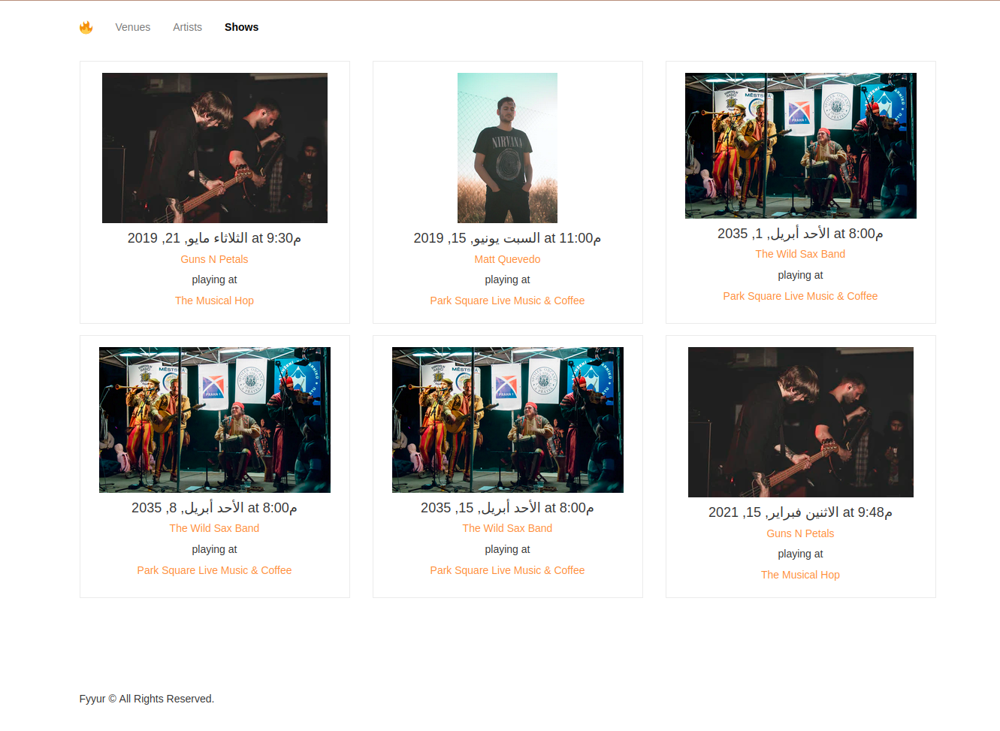
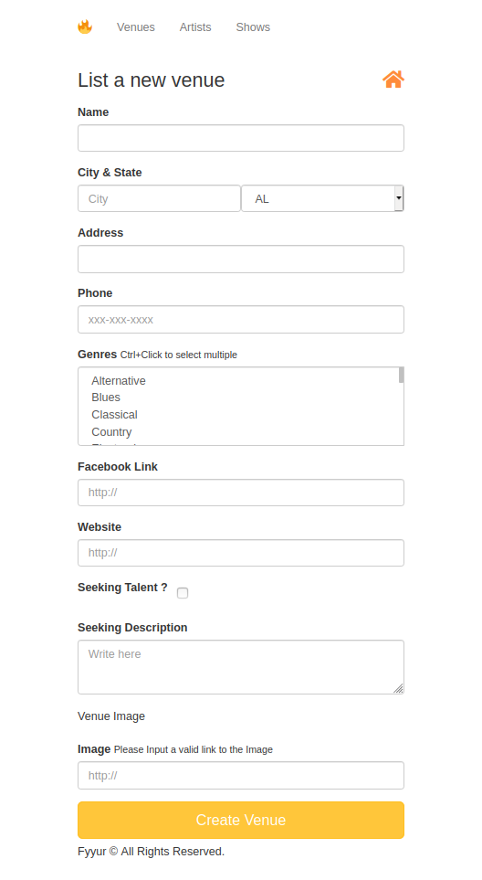
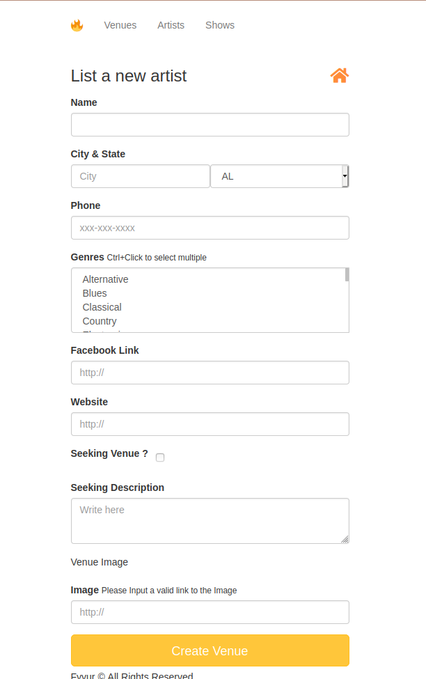
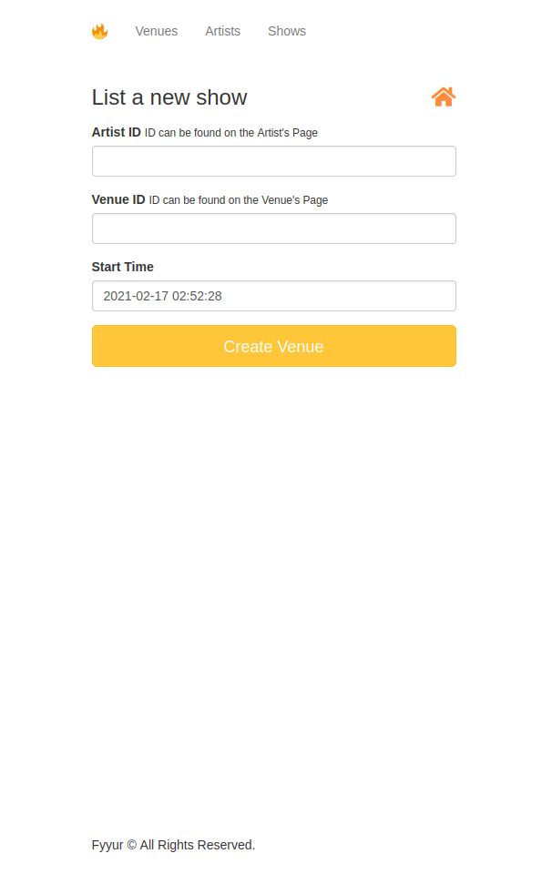

Fyyur is a musical venue and artist booking site that facilitates the discovery and bookings of shows between local performing artists and venues. This site lets you list new artists and venues, discover them, and list shows with artists as a venue owner.
It's the first project in FSND (Full Stack Nano Degree) On [Udaicty](https://www.udacity.com/course/full-stack-web-developer-nanodegree--nd0044).


My job was to build out the data models to power the API endpoints for the Fyyur site by connecting to a PostgreSQL database for storing, querying, and creating information about artists and venues on Fyyur.


### Tech Stack (Dependencies)

#### 1. Backend Dependencies
 * **virtualenv** as a tool to create isolated Python environments
 * **SQLAlchemy ORM**  ORM library
 * **PostgreSQL** the database
 * **Python3** and **Flask** as the server language and server framework
 * **Flask-Migrate** for creating and running schema migrations

#### 2. Frontend Dependencies
[Bootstrap 3](https://getbootstrap.com/docs/3.4/customize/). Make sure to install the [Node.js](https://nodejs.org/en/download/), verify the installation as shown below.
```
node -v
npm -v
```
Install [Bootstrap 3](https://getbootstrap.com/docs/3.3/getting-started/) for the website's frontend:
```
npm init -y
npm install bootstrap@3
```


## Main Files: Project Structure

  ```sh
  ├── README.md
  ├── app.py *** the main driver of the app.
                    "python app.py" to run after installing dependences
  ├── models.py *** Includes SQLAlchemy models.
  ├── config.py *** Database URLs, CSRF generation, etc
  ├── error.log
  ├── forms.py *** Flask forms
  ├── requirements.txt *** The dependencies needed
  ├── static
  │   ├── css 
  │   ├── font
  │   ├── ico
  │   ├── img
  │   └── js
  └── templates
      ├── errors
      ├── forms
      ├── layouts
      └── pages
  ```

## Screenshots 


***

***

***


***
<p float="left" align = "middle">
  
   
  
</p>

***


##  Try It
1. **Download the project code locally**
```
git clone https://github.com/Passant-Abdelgalil/Fyyur-Backend.git
cd Fyyur-Backend
```
2. **Initialize and activate a virtualenv using:**
```
python -m virtualenv env
source env/bin/activate
```
>**Note** - In Windows, the `env` does not have a `bin` directory. Therefore, you'd use the analogous command shown below:
```
source env/Scripts/activate
```

3. **Install the dependencies:**
```
pip install -r requirements.txt
```
4. **Database Config**
```
make sure to change the connection string in config.py to meet your database
```
1. **Run the app:**
```
export FLASK_APP=myapp
python3 app.py
```
